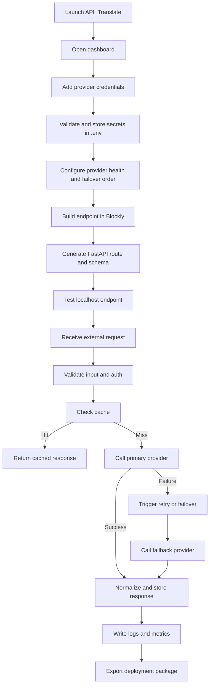

## 1. Product Overview
API_Translate is an open-source, self-hostable AI API gateway that lets users connect many AI providers, visually compose localhost endpoints, and safely expose production-ready APIs from one dashboard.
- It solves provider sprawl, inconsistent API formats, fragile failover logic, and secret management for developers, hobbyists, and small teams.
- It delivers a beginner-friendly local deployment experience while remaining extensible enough for advanced plugin, deployment, and gateway workflows.

## 2. Core Features

### 2.1 User Roles
| Role | Registration Method | Core Permissions |
|------|---------------------|------------------|
| Guest | None | Access public docs and local status page in minimal mode |
| Admin | Local password setup | Manage providers, keys, routes, deployments, logs, settings, and documentation |

### 2.2 Feature Module
1. **Dashboard**: operational metrics, charts, recent activity, provider health, and endpoint summaries
2. **Providers**: plugin discovery, provider configuration, health checks, failover chains, and model capabilities
3. **API Keys**: secure key vault, masked secret display, environment synchronization, and validation
4. **Endpoint Builder**: Blockly-based route designer with blocks for prompts, models, auth, cache, transforms, retries, and custom Python
5. **Deployments**: packaging wizard for binaries, Docker, serverless targets, and infrastructure output
6. **Logs**: searchable request logs, provider selection trace, cache outcomes, and export tools
7. **Settings**: auth protection, CORS, rate limits, security policy, cache defaults, and minimal mode behavior
8. **Documentation**: generated endpoint docs, request/response examples, provider setup guides, and deployment help

### 2.3 Page Details
| Page Name | Module Name | Feature description |
|-----------|-------------|---------------------|
| Dashboard | KPI header | Shows active providers, requests today, requests this month, average latency, failed requests, running endpoints, cache hit rate, and failover events |
| Dashboard | Analytics panels | Displays request volume, latency trends, cache performance, provider health, and failover frequency graphs |
| Providers | Provider registry | Lists built-in plugins, enabled state, supported capabilities, and health status |
| Providers | Provider editor | Adds or updates provider credentials, base URLs, model defaults, timeout, retry, and failover rules |
| API Keys | Vault table | Displays masked keys, provider binding, last updated time, and validation state |
| API Keys | Secret form | Writes secrets to backend `.env`, creates file if missing, and never returns raw keys to the UI |
| Endpoint Builder | Blockly canvas | Lets users connect blocks representing request flow, auth, transforms, cache, provider choice, and output formatting |
| Endpoint Builder | Route preview | Generates FastAPI endpoint definitions and OpenAPI-friendly schemas from Blockly graphs |
| Deployments | Wizard | Guides users through binary, Docker, VPS, and serverless export targets |
| Logs | Explorer | Filters logs by status, provider, endpoint, date, cache result, and failover event |
| Settings | Security panel | Configures dashboard password, secure headers, CORS, rate limits, sessions, and CSRF behavior |
| Documentation | Generated docs | Renders endpoint docs, example payloads, provider instructions, and install/deploy tutorials |

## 3. Core Process
Primary flow: the admin launches the app, adds provider credentials, configures health and failover behavior, visually builds endpoints with Blockly, tests routes locally, reviews logs and metrics, then exports the project for deployment as a binary or server package.

Secondary flow: external software calls localhost routes using OpenAI-compatible payloads, the gateway validates input, checks cache, routes to the preferred provider, applies retries and failovers if needed, logs the outcome, and returns a normalized response.

## 4. User Interface Design
### 4.1 Design Style
- Primary palette: graphite black, deep zinc, cool slate, and muted glass surfaces with electric cyan and violet accents
- Button style: soft-rounded panels with luminous borders, subtle depth, and strong hover states
- Typography: a refined geometric display face paired with a clean readable sans for dense management interfaces
- Layout style: desktop-first split layout with persistent sidebar, metric cards, layered panels, and high-density work surfaces
- Icon style: minimal line icons using a consistent technical control-panel language
- Motion style: gentle panel fades, chart transitions, drag cues in Blockly, hover glows, and route-generation micro-animations

### 4.2 Page Design Overview
| Page Name | Module Name | UI Elements |
|-----------|-------------|-------------|
| Dashboard | KPI header | Dark glass cards, gradient numeric emphasis, animated deltas, and compact status chips |
| Dashboard | Charts | Smoothed area and bar charts with subtle glow, low-contrast gridlines, and responsive legends |
| Providers | Registry | Searchable cards, provider badges, health pills, and sticky quick actions |
| API Keys | Vault | Masked monospace fields, secure-state indicators, and confirmation dialogs |
| Endpoint Builder | Canvas | Full-height editor, draggable blocks, split preview panels, and endpoint schema drawer |
| Deployments | Wizard | Stepper layout, illustrated target cards, generated file checklist, and export summary |
| Logs | Explorer | Dense table, column filters, latency badges, and side detail panel |
| Settings | Security panel | Toggle groups, warnings, validation hints, and guided setup blocks |
| Documentation | Knowledge hub | Sidebar outline, code examples, API schema cards, and copy-to-clipboard actions |

### 4.3 Responsiveness
The experience is desktop-first for workflow-heavy screens, but adapts to tablet and mobile through collapsible sidebars, stacked panels, horizontal card scrolling, and reduced-density editor layouts. Critical operational data remains visible at common laptop widths.
