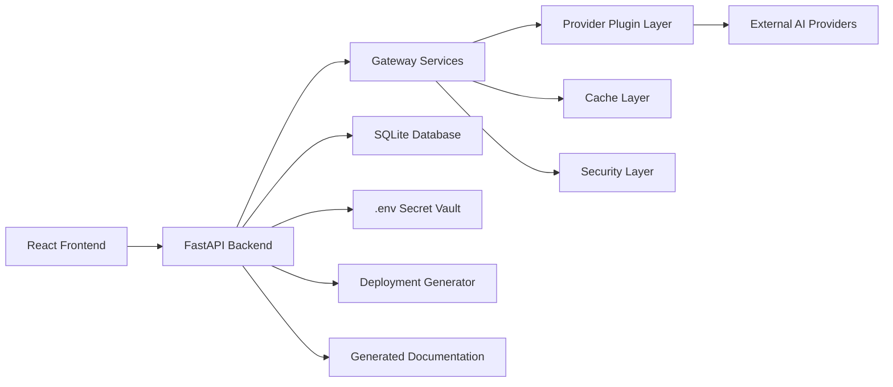
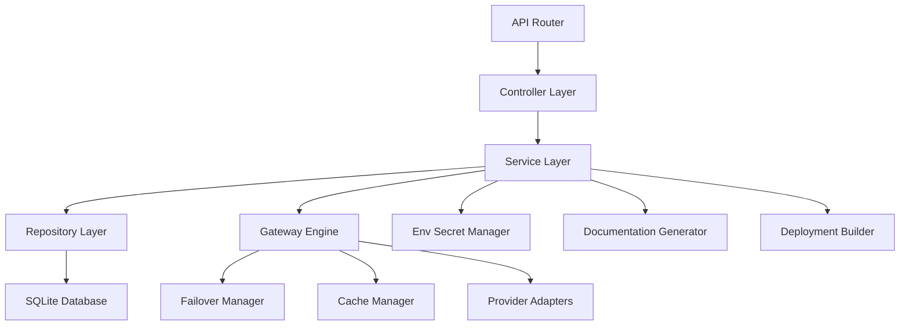
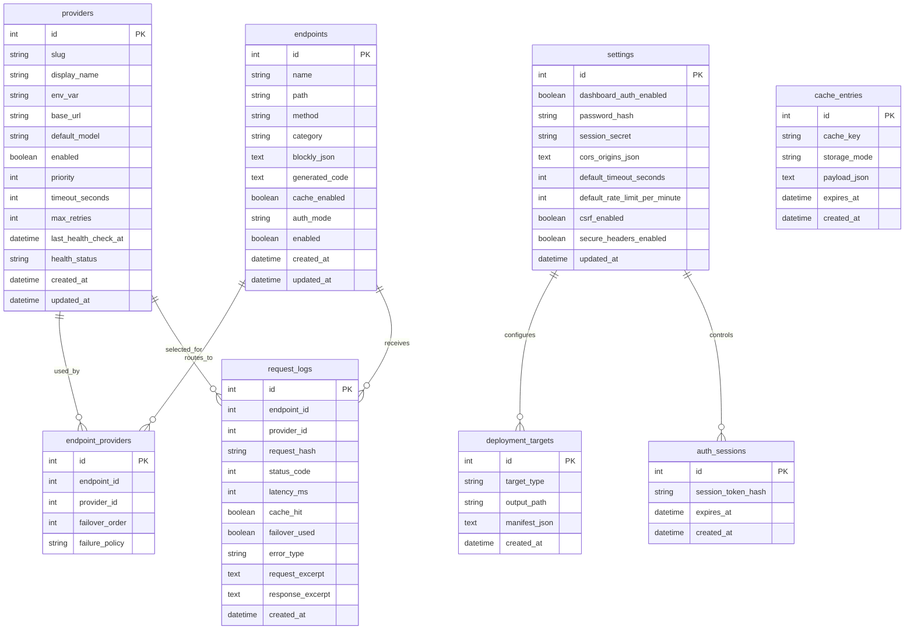

## 1. Architecture Design


## 2. Technology Description
- Frontend: React 18 + TypeScript + Vite + TailwindCSS + shadcn/ui + Zustand + Blockly
- Backend: Python 3.12 + FastAPI + Uvicorn + Pydantic + SQLAlchemy + python-dotenv
- Database: SQLite with SQLAlchemy ORM and automatic startup initialization
- Packaging: PyInstaller + Docker + Docker Compose
- Testing: Pytest for backend, Vitest for frontend, and lightweight API smoke validation
- Observability: structured logging, request audit trail, provider health metrics, and exportable logs

## 3. Route Definitions
| Route | Purpose |
|-------|---------|
| / | Main dashboard shell |
| /providers | Manage provider plugins, health, failover, and model defaults |
| /api-keys | Manage masked credentials and environment-backed vault records |
| /builder | Build API routes visually with Blockly |
| /deployments | Generate deployment artifacts |
| /logs | Inspect gateway activity and request traces |
| /settings | Configure security, limits, cache, and runtime settings |
| /docs | Browse generated application and endpoint documentation |
| /login | Authenticate when dashboard protection is enabled |

## 4. API Definitions
### 4.1 Shared Type Definitions
```ts
type ProviderType =
  | "openai"
  | "anthropic"
  | "gemini"
  | "groq"
  | "openrouter"
  | "custom_openai";

interface ProviderConfigInput {
  provider: ProviderType | string;
  displayName: string;
  baseUrl?: string;
  apiKey?: string;
  defaultModel?: string;
  timeoutSeconds: number;
  maxRetries: number;
  enabled: boolean;
  priority: number;
}

interface EndpointNode {
  id: string;
  type: string;
  config: Record<string, unknown>;
}

interface EndpointDefinitionInput {
  name: string;
  path: string;
  method: "POST" | "GET";
  blocks: EndpointNode[];
  authMode: "public" | "dashboard_password";
  cacheEnabled: boolean;
}
```

### 4.2 Core Backend APIs
| Method | Route | Purpose |
|-------|-------|---------|
| GET | /api/health | Startup and runtime health |
| GET | /api/dashboard/summary | Aggregate KPI data for dashboard |
| POST | /api/providers/add | Add a provider and optionally store its API key |
| POST | /api/providers/update | Update provider configuration and key mapping |
| DELETE | /api/providers/remove | Remove a provider configuration |
| GET | /api/providers/list | List configured providers with masked secrets |
| GET | /api/providers/catalog | List built-in provider plugins and capability metadata |
| POST | /api/keys/save | Persist a provider secret to `.env` and vault metadata |
| GET | /api/keys/list | List vault entries with masked values only |
| POST | /api/endpoints/generate | Generate endpoint definition from Blockly JSON |
| GET | /api/endpoints/list | List configured routes |
| POST | /api/gateway/test | Send a test request through gateway routing |
| GET | /api/logs | Query request and audit logs |
| GET | /api/logs/export | Export logs as JSON |
| POST | /api/deployments/build | Generate deployment target artifacts |
| GET | /api/docs/generated | Return generated documentation data |
| POST | /api/auth/login | Create a protected dashboard session |
| POST | /api/auth/logout | Revoke session |
| GET | /api/settings | Read application settings |
| POST | /api/settings | Update settings |

### 4.3 Generated Localhost Gateway APIs
| Method | Route | Purpose |
|-------|-------|---------|
| POST | /v1/chat/completions | OpenAI-compatible chat endpoint |
| POST | /v1/completions | Text completion endpoint |
| POST | /v1/embeddings | Embedding endpoint |
| POST | /v1/images | Image generation endpoint |
| POST | /v1/audio/transcriptions | Audio transcription endpoint |
| POST | /api/custom | User-defined custom workflow endpoint |
| POST | /api/translate | Example generated translation endpoint |

## 5. Server Architecture Diagram


## 6. Data Model
### 6.1 Data Model Definition


### 6.2 Data Definition Language
```sql
CREATE TABLE providers (
    id INTEGER PRIMARY KEY AUTOINCREMENT,
    slug TEXT NOT NULL UNIQUE,
    display_name TEXT NOT NULL,
    env_var TEXT NOT NULL UNIQUE,
    base_url TEXT,
    default_model TEXT,
    enabled INTEGER NOT NULL DEFAULT 1,
    priority INTEGER NOT NULL DEFAULT 0,
    timeout_seconds INTEGER NOT NULL DEFAULT 60,
    max_retries INTEGER NOT NULL DEFAULT 2,
    last_health_check_at DATETIME,
    health_status TEXT NOT NULL DEFAULT 'unknown',
    created_at DATETIME NOT NULL DEFAULT CURRENT_TIMESTAMP,
    updated_at DATETIME NOT NULL DEFAULT CURRENT_TIMESTAMP
);

CREATE TABLE endpoints (
    id INTEGER PRIMARY KEY AUTOINCREMENT,
    name TEXT NOT NULL,
    path TEXT NOT NULL UNIQUE,
    method TEXT NOT NULL DEFAULT 'POST',
    category TEXT NOT NULL DEFAULT 'custom',
    blockly_json TEXT NOT NULL,
    generated_code TEXT NOT NULL,
    cache_enabled INTEGER NOT NULL DEFAULT 0,
    auth_mode TEXT NOT NULL DEFAULT 'public',
    enabled INTEGER NOT NULL DEFAULT 1,
    created_at DATETIME NOT NULL DEFAULT CURRENT_TIMESTAMP,
    updated_at DATETIME NOT NULL DEFAULT CURRENT_TIMESTAMP
);

CREATE TABLE endpoint_providers (
    id INTEGER PRIMARY KEY AUTOINCREMENT,
    endpoint_id INTEGER NOT NULL,
    provider_id INTEGER NOT NULL,
    failover_order INTEGER NOT NULL DEFAULT 0,
    failure_policy TEXT NOT NULL DEFAULT 'timeout,rate_limit,network_failure,invalid_response,provider_offline'
);

CREATE TABLE request_logs (
    id INTEGER PRIMARY KEY AUTOINCREMENT,
    endpoint_id INTEGER,
    provider_id INTEGER,
    request_hash TEXT,
    status_code INTEGER,
    latency_ms INTEGER,
    cache_hit INTEGER NOT NULL DEFAULT 0,
    failover_used INTEGER NOT NULL DEFAULT 0,
    error_type TEXT,
    request_excerpt TEXT,
    response_excerpt TEXT,
    created_at DATETIME NOT NULL DEFAULT CURRENT_TIMESTAMP
);

CREATE INDEX idx_request_logs_created_at ON request_logs(created_at);
CREATE INDEX idx_request_logs_status_code ON request_logs(status_code);
CREATE INDEX idx_request_logs_provider_id ON request_logs(provider_id);

CREATE TABLE cache_entries (
    id INTEGER PRIMARY KEY AUTOINCREMENT,
    cache_key TEXT NOT NULL UNIQUE,
    storage_mode TEXT NOT NULL DEFAULT 'sqlite',
    payload_json TEXT NOT NULL,
    expires_at DATETIME NOT NULL,
    created_at DATETIME NOT NULL DEFAULT CURRENT_TIMESTAMP
);

CREATE TABLE settings (
    id INTEGER PRIMARY KEY AUTOINCREMENT,
    dashboard_auth_enabled INTEGER NOT NULL DEFAULT 0,
    password_hash TEXT,
    session_secret TEXT NOT NULL,
    cors_origins_json TEXT NOT NULL DEFAULT '["*"]',
    default_timeout_seconds INTEGER NOT NULL DEFAULT 60,
    default_rate_limit_per_minute INTEGER NOT NULL DEFAULT 120,
    csrf_enabled INTEGER NOT NULL DEFAULT 1,
    secure_headers_enabled INTEGER NOT NULL DEFAULT 1,
    updated_at DATETIME NOT NULL DEFAULT CURRENT_TIMESTAMP
);

CREATE TABLE auth_sessions (
    id INTEGER PRIMARY KEY AUTOINCREMENT,
    session_token_hash TEXT NOT NULL UNIQUE,
    expires_at DATETIME NOT NULL,
    created_at DATETIME NOT NULL DEFAULT CURRENT_TIMESTAMP
);

CREATE TABLE deployment_targets (
    id INTEGER PRIMARY KEY AUTOINCREMENT,
    target_type TEXT NOT NULL,
    output_path TEXT NOT NULL,
    manifest_json TEXT NOT NULL,
    created_at DATETIME NOT NULL DEFAULT CURRENT_TIMESTAMP
);
```
