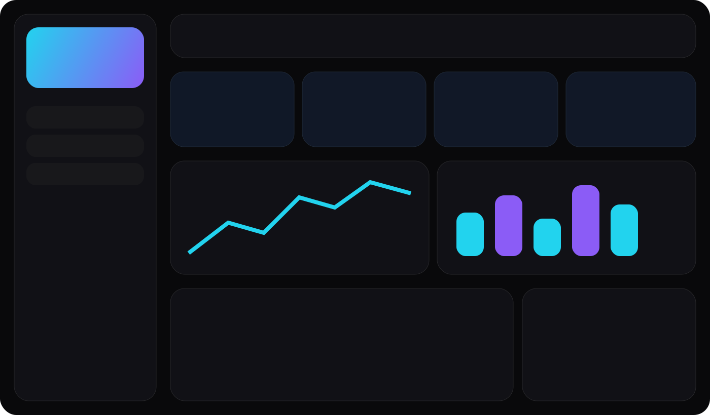
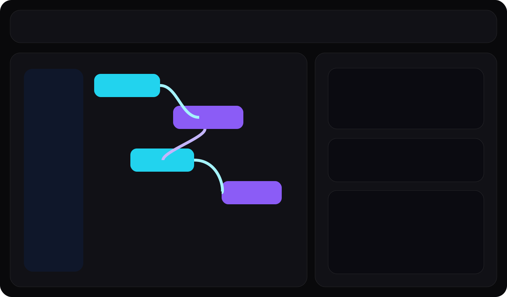
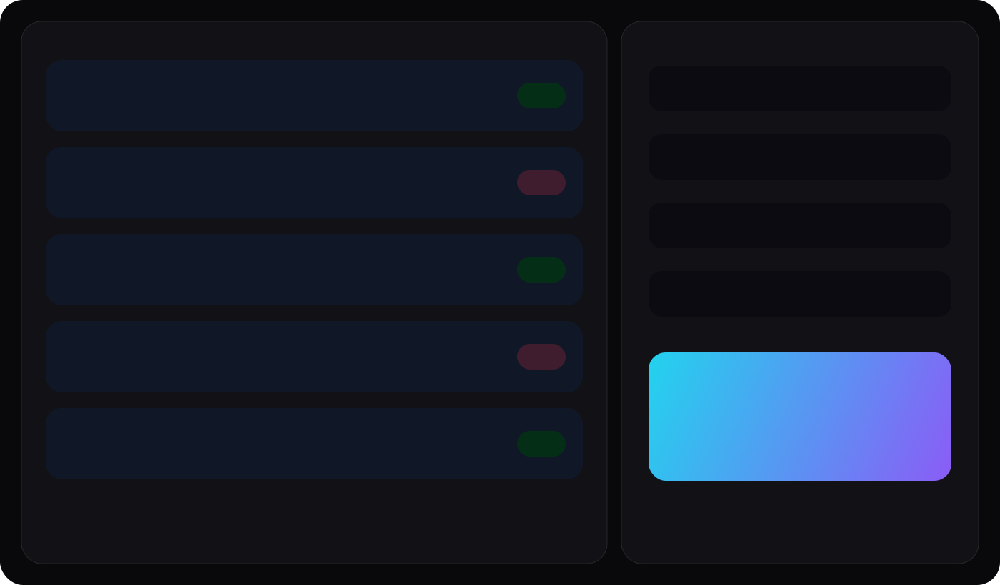

# AI-Translator

AI-Translator is an open-source AI API gateway for self-hosted routing, failover, caching, visual endpoint generation, and safe API key management.

It combines a FastAPI backend, a React dashboard, a Blockly endpoint builder, SQLite auto-initialization, deployment export tools, and localhost OpenAI-compatible endpoints in one beginner-friendly project.

## Screenshots




## Features
- Connect many AI providers through a shared plugin registry
- Save provider secrets to backend `.env` automatically with masked UI output
- Build custom endpoints visually with Blockly and generate FastAPI routes
- Expose localhost endpoints such as `/v1/chat/completions`, `/v1/completions`, `/v1/embeddings`, `/v1/images`, `/v1/audio/transcriptions`, and custom routes
- Configure provider order, retries, timeouts, and failover behavior
- Cache responses in memory or SQLite
- Protect the dashboard with a password, hashed sessions, CSRF checks, and secure headers
- Generate deployment bundles for Docker, VPS, serverless starters, and PyInstaller builds
- Run in full dashboard mode or lightweight `--minimal` mode

## Tech Stack
- Backend: Python 3.12+, FastAPI, Uvicorn, Pydantic, SQLAlchemy
- Frontend: React, TypeScript, Vite, TailwindCSS, Blockly, Zustand, Recharts
- Database: SQLite
- Packaging: Docker, Docker Compose, PyInstaller
- Testing: Pytest, TypeScript check, frontend build validation

## Installation
### Python Mode
```bash
git clone https://github.com/StarGazerDevelopment/API_TRANSLATE.git
cd API_Translate
pip install -r requirements.txt
python main.py
```

The repository already includes the built dashboard in `frontend/dist`, so Python mode does not require Node.js or `npm` on the machine that runs the app.

If `localhost:8000` is already used by another app on your machine, start AI-Translator on a different port:

```bash
python main.py --port 8012
```

### Docker Mode
```bash
docker compose up
```

## Development Setup
The repository includes both the React source in `frontend/` and the prebuilt dashboard assets in `frontend/dist`.

To work on the frontend locally:

```bash
cd frontend
npm install
npm run dev
```

To produce the static bundle served by FastAPI:

```bash
cd frontend
npm install
npm run build
```

## Minimal Mode
Run a lower-overhead status page while keeping the gateway active:

```bash
python main.py --minimal
```

## Provider Setup Guide
1. Start the app and open the dashboard.
2. Go to `Providers`.
3. Select a provider from the built-in catalog.
4. Enter the API key and base URL if needed.
5. Save the provider.
6. Confirm the key appears masked in `API Keys`.
7. Add fallback providers in the preferred priority order.

Example `.env` entries:

```env
OPENAI_API_KEY=xxxx
ANTHROPIC_API_KEY=xxxx
GROQ_API_KEY=xxxx
OPENROUTER_API_KEY=xxxx
GEMINI_API_KEY=xxxx
```

## API Examples
If a request to `http://localhost:8000` returns an SSL error or unrelated HTML page, AI-Translator is not the service answering on that port. Use the port shown in the AI-Translator terminal output instead.

### OpenAI-Compatible Chat Request
```bash
curl -X POST http://127.0.0.1:8000/v1/chat/completions \
  -H "Content-Type: application/json" \
  -d "{\"model\":\"gpt-4o-mini\",\"messages\":[{\"role\":\"user\",\"content\":\"Hello from API_Translate\"}]}"
```

### Custom Route Request
```bash
curl -X POST http://127.0.0.1:8000/api/translate \
  -H "Content-Type: application/json" \
  -d "{\"text\":\"Translate this to French\",\"target_language\":\"fr\"}"
```

### Python Example
```python
import requests

response = requests.post(
    "http://127.0.0.1:8000/v1/chat/completions",
    json={
        "model": "gpt-4o-mini",
        "messages": [
            {"role": "system", "content": "You are a helpful coding assistant."},
            {"role": "user", "content": "Say hello from AI-Translator."},
        ],
    },
    timeout=60,
)

response.raise_for_status()
print(response.json())
```

### Provider Management Endpoints
```bash
curl http://127.0.0.1:8000/api/providers/list
curl -X POST http://127.0.0.1:8000/api/providers/add -H "Content-Type: application/json" -d "{\"provider\":\"openai\",\"displayName\":\"OpenAI\"}"
curl -X POST http://127.0.0.1:8000/api/providers/update -H "Content-Type: application/json" -d "{\"provider\":\"openai\",\"displayName\":\"OpenAI\"}"
curl -X DELETE http://127.0.0.1:8000/api/providers/remove -H "Content-Type: application/json" -d "{\"slug\":\"openai\"}"
```

## AI Agent Examples
Use AI-Translator as a local OpenAI-compatible endpoint so coding agents can route through your own provider, fallback, and caching setup.

### Claude Code
Claude Code supports gateway and proxy configuration through `ANTHROPIC_BASE_URL`. Point it at your local AI-Translator endpoint, then launch `claude`.

macOS / Linux:

```bash
export ANTHROPIC_BASE_URL=http://127.0.0.1:8000/v1
export ANTHROPIC_API_KEY=dummy-local-key
export ANTHROPIC_MODEL=gpt-4o-mini
claude
```

Windows PowerShell:

```powershell
$env:ANTHROPIC_BASE_URL = "http://127.0.0.1:8000/v1"
$env:ANTHROPIC_API_KEY = "dummy-local-key"
$env:ANTHROPIC_MODEL = "gpt-4o-mini"
claude
```

If you expose a different flow or model name, set `ANTHROPIC_MODEL` to the same model string that your AI-Translator flow expects.

### Codex CLI
Codex uses the OpenAI-compatible protocol, so the fastest test is to point `OPENAI_BASE_URL` at AI-Translator and run `codex`.

macOS / Linux:

```bash
export OPENAI_BASE_URL=http://127.0.0.1:8000/v1
export OPENAI_API_KEY=dummy-local-key
export OPENAI_MODEL=gpt-4o-mini
codex
```

Windows PowerShell:

```powershell
$env:OPENAI_BASE_URL = "http://127.0.0.1:8000/v1"
$env:OPENAI_API_KEY = "dummy-local-key"
$env:OPENAI_MODEL = "gpt-4o-mini"
codex
```

For a persistent Codex setup, create `~/.codex/config.toml`:

```toml
model = "gpt-4o-mini"
model_provider = "ai_translator"

[model_providers.ai_translator]
name = "AI-Translator"
base_url = "http://127.0.0.1:8000/v1"
env_key = "OPENAI_API_KEY"
wire_api = "chat"
```

### Python Agent Example
This works for lightweight custom agents, tool runners, or orchestration scripts:

```python
import requests

def ask_agent(prompt: str) -> str:
    response = requests.post(
        "http://127.0.0.1:8000/v1/chat/completions",
        json={
            "model": "gpt-4o-mini",
            "messages": [
                {"role": "system", "content": "You are a local AI agent running through AI-Translator."},
                {"role": "user", "content": prompt},
            ],
        },
        timeout=60,
    )
    response.raise_for_status()
    data = response.json()
    return data["choices"][0]["message"]["content"]

print(ask_agent("Summarize this repository structure."))
```

### Why Use AI-Translator For Agents
- Route multiple coding agents through one local endpoint
- Switch providers without changing every client tool
- Add fallback providers for reliability
- Cache repeated prompts from agent loops
- Keep upstream API keys off the agent client machine

## Deployment Guide
### Docker
```bash
docker compose up --build
```

### Executable
```bash
pyinstaller api_translate.spec
```

When you choose `Windows EXE` in the dashboard and enable `Build artifact now`, AI-Translator prompts for a save location and copies the finished `AI-Translator.exe` to that exact folder or file path.

### Generated Bundles
Use the dashboard `Deployments` page to create starter output folders in `exports/` for:
- Windows EXE
- Linux Binary
- macOS App
- Docker
- Render
- Railway
- Fly.io
- VPS
- Vercel
- Cloudflare Workers
- Netlify

## Project Structure
```text
app/                 FastAPI application, models, routes, services, provider registry
frontend/            React dashboard source
tests/               Pytest suite
docs/screenshots/    README visuals
exports/             Generated deployment bundles
.trae/documents/     PRD and technical architecture
main.py              Runtime entry point
```

## Security Notes
- Raw API keys are never returned from the backend
- The frontend never stores provider keys in `localStorage`
- Optional dashboard password uses bcrypt hashing
- Sessions use secure cookies and CSRF token checks
- Secure headers and CORS settings are configurable
- Request logs support audit visibility without exposing secrets

## Contributing
See `CONTRIBUTING.md` for local workflow and contribution expectations.

## License
MIT. See `LICENSE`.
